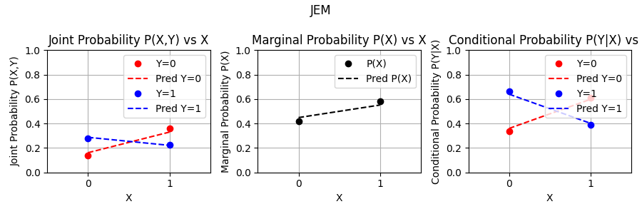

#  JEM Control Dataset
## Motivation and problem statement
Deep learning classifiers are widely used. Reliable classification confidences are important for safety critical applications, like medical diagnoses or self-driving cars [1]. Out-of-distribution detection further helps by alerting to potential model failure, when the test sample is unlike the training domain [2]. 

Reliable confidences and out-of-distribution detections require classifiers to be well "calibrated" [1]: their output values should match true probabilities. The problem is that this is not guaranteed by the standard training method (i.e. softmax activation and cross-entropy loss).

Authors of the Joint Energy Model (JEM) claim their modified training procedure solves the issue [3]. However, they only applied it to a complex dataset where true probabilities are not known. Furthermore, biased approximations were necessary for speed and the core algorithm could not be tested in isolation.

So, the problem is both to verify whether normal classifiers are not calibrated well in this sense, and to be able to test alternative methods like JEM that supposedly do yield calibrated models.

## Dataset
This control dataset helps by simplifying the data to a very low-dimensional discrete problem, so we can compute the true probabilities and no approximations are necessary. Specifically, binary classification with a single binary feature is used. This was chosen as it is the simplest non-trivial classification dataset.

The dataset consists of 1000 (x,y) pairs of either (0,0), (0,1), (1,0) or (1,1). Specifically, there are:
- 141 samples of (0,0)
- 276 samples of (0,1)
- 358 samples of (1,0)
- 225 samples of (1,1) 

A scatterplot shows that most points overlap:

More important are the distributions of the samples. The properties to test are the class-conditional distribution P(y|x), which gives the class confidences, and the marginal distribution P(x), which gives probability of a sample being in the distribution. These can all be derived from the joint distribution, shown in the following table:

### Generation
The dataset was generated by first generating the joint distribution as seen in the table above, and then sampling from it. Specifically:

1. Sample four random numbers *p00*, *p01*, *p10*, *p11* uniformly from [0,1]
2. Normalize the numbers by dividing each by the sum of all four numbers
3. Initialize empty dataset D
4. For i = 1 to N:
   - Sample (x,y) from [(0,0), (0,1), (1,0), (1,1)] with probabilities [p00, p01, p10, p11]
   - Add (x,y) to D
5. Return D

This approach was used because it tends to give a noticeable difference between each P(y|x) and P(x) value, which should help make the results more interpretable. If for example, each point was sampled random uniformly first, and then the distribution was measured afterwards, the distribution would tend towards each P(y|x) or P(x) value being equal (central limit theorem).

## Experiment
Since the dataset is quite simple, to expand on this contribution the experiment itself is conducted as well. The baseline is a linear model with 1 input, 2 outputs and a softmax activation, trained with cross-entropy loss on the entire dataset. This is repeated using the JEM training procedure with the same architecture.

For each model, the confidences are compared against the true class probabilities P(y|x). The confidences are obtained the standard way, by making a prediction and applying softmax activation, which normalizes along the class dimension:

$P(y|x) = \frac{\exp(f(x,y))}{\sum_{y} \exp(f(x,y))}$

Where f(x,y) gives the model logits. For the marginal probability P(x), as described in the JEM paper, the same is done, but by summing across the classes and normalizing over all four x,y values:

$P(x) = \sum_y P(y|x) = \sum_y \frac{\exp(f(x,y))}{\sum_{x,y} \exp(f(x,y))}$

This gives the following plots as a result:

This shows that the baseline model gets the P(y|x) approximately correct, but not P(x). Whereas the model trained as JEM gets both P(y|x) and P(x) approximately correct. 

In conclusion, this control experiment did not confirm that standard classifiers lead to badly calibrated class confidences. However, it does support the claim that a training procedure like JEM is necessary to achieve calibrated marginal probabilities, and thus reliable out-of-distribution detections.

# References
1. Guo et al., 2017, [On Calibration of Modern Neural Networks](https://proceedings.mlr.press/v70/guo17a.html)

2. Hendrycks, D., & Gimpel, K., 2016, [A Baseline for Detecting Misclassified and Out-of-Distribution Examples in Neural Networks](https://arxiv.org/abs/1610.02136)

3. Grathwohl et al., 2020, [JEM: Why your Classifier is Secretly an Energy-Based Model and you should treat it like one](https://arxiv.org/abs/1912.03263) 