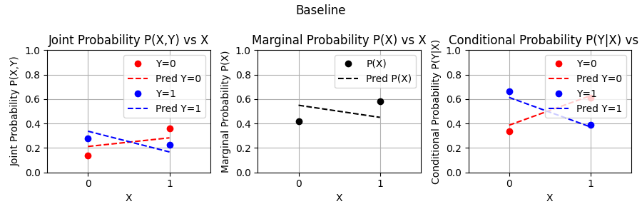
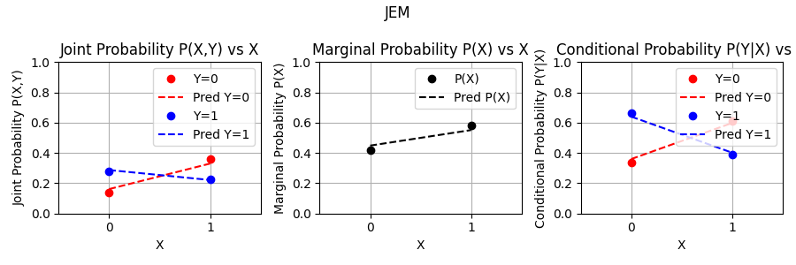

#  JEM Control Dataset
## Background

This control dataset is meant to test properties that are mentioned in in the paper "JEM: Why your Classifier is Secretly an Energy-Based Model and you should treat it like one". They describe that pre-softmax logits from standard cross-entropy loss-based training can be reinterpreted and used as an energy function to learn the joint distribution. 

Specifically:

If model logits $f(x,y)$ are interpreted as $-E(x,y)$, then the joint distribution of an energy-based model is given by:

$P(x,y) = \frac{\exp(-E(x,y))}{\sum_{x,y} \exp(-E(x,y))} = \frac{\exp(f(x,y))}{\sum_{x,y} \exp(f(x,y))}$

The marginal distribution of $x$ is given by:

$P(x) = \sum_y P(x,y)$

The conditional distribution of $y$ given $x$ is given by:

$P(y|x) = \frac{\exp(-E(x,y))}{\sum_y \exp(-E(x,y))} = \frac{\exp(f(x,y))}{\sum_y \exp(f(x,y))} = \text{softmax}(f(x,y))$

They present a training procedure to exploit these symmetries. The main claim to test here is that a standard classifier would not satisfy all these properties, but that their proposed training procedure does.

## Control dataset
As their derivations seem sound, it is expected that their claims are valid. So, they immediately apply this to a computer vision task of high dimensionality, which requires approximations and biased samplers in practice. It can still be valuable to confirm their claim first on a simple task that does not require those approximations and whose results are easier to interpret.

The values of interest are the logits f(x,y), and the true and predicted p(x) and p(y|x). And they should be learnable by means of gradient descent. This leaves practically any classification dataset as a candidate. However, I would argue that for the purpose of this control dataset experiment there are still decisions to be made. Namely, the most suitable is the absolute simplest non-trivial dataset. This can be binary classification, with a single binary feature. The entire dataset can then be shown as four numbers in a joint probability table:

To confirm wether the theory holds, it could be visualized that a standard classifier does correctly learn p(y|x), but that when interpreting the logits directly, they do not represent the joint distribution and marginal p(x). While this should indeed be the case for their proposed training procedure. With the measures visualised as below.

A sample dataset with the joint probabilities from above is included in the `data` folder. It is generated by sampling four uniformely distributed random numbers between 0 and 1, normalizing them to sum to 1, interpreting them as joint probabilites. The dataset is then generated by sampling x and y based on the marginal probabilities.

## Control experiment
The suggested dataset seems extremely simple. In this context that is exactly the goal. However, to expand on this given the simplicity of the assignment so far, the experiment itself is conducted as well.

A simple linear model with 1 input, 2 outputs and a softmax function is trained on the dataset as baseline. 

This yields the following results:

The training procedure for JEM can be found in their paper[1]. It requires generating samples during training. They use a biased sampler based on gradients and noise to generate images. For the simple toy dataset we can ignore their biased sampler and compute the probabilities for the two possible values of x directly instead. It is implemented in the `main.ipynb` notebook.

The results are as follows:

The results on this toy dataset do indeed seem to show the initial problem the authors describe, and their JEM procedure does yield the correct results, as it jointly learns not only the conditional distribution, but also follows the joint and marginal distribution more closely.

# References
1. Grathwohl et al., 2020, [JEM: Why your Classifier is Secretly an Energy-Based Model and you should treat it like one](https://arxiv.org/abs/1912.03263) 

