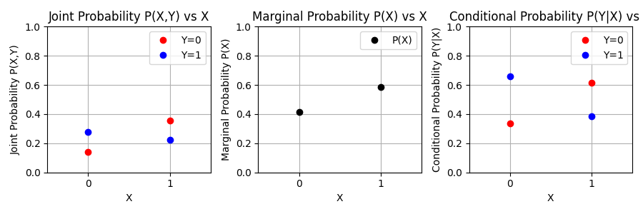

#  JEM Control Dataset
This control dataset is meant to test properties that are mentioned in in the paper "JEM: Why your Classifier is Secretly an Energy-Based Model and you should treat it like one". They describe that pre-softmax logits from standard cross-entropy loss-based training can be reinterpreted and used as an energy function to learn the joint distribution. This is motivated by theory and then applied directly to a computer vision task of high dimensionality, which requires approximations and biased samplers in practice. It also relies on training a complex neural network.

As their theory seems mathematically sound, it is expected that their claims are valid. However, it can still be valuable to test their approach on a simple task that does not require biased approximations and whose results are easier to interpret.

The values of interest are the logits f(x,y), and the true and predicted p(x) and p(y|x). And they should be learnable by means of gradient descent. This leaves practically any classification dataset as a candidate. However, I would argue that for the purpose of this control dataset experiment there are still decisions to be made. Namely, the most suitable is the absolute simplest non-trivial dataset. This can be binary classification, with a single binary feature. The entire dataset can then be shown as four numbers in a joint probability table:

To confirm wether the theory holds, it can be visualized that a standard classifier does correctly learn p(y|x), but that when interpreting the logits directly, they do not represent the joint distribution and marginal p(x). While this should indeed be the case for their proposed training procedure. 

A sample dataset with the joint probabilites from above is included in the `data` folder. It is generated by sampling four uniformely distributed random numbers between 0 and 1, normalizing them to sum to 1, interpreting them as joint probabilites. The dataset is then generated by sampling x and y based on the marginal probabilities.

# References
1. Grathwohl et al., 2020, [JEM: Why your Classifier is Secretly an Energy-Based Model and you should treat it like one](https://arxiv.org/abs/1912.03263) 

